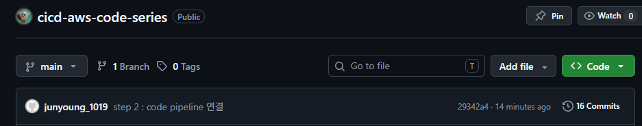
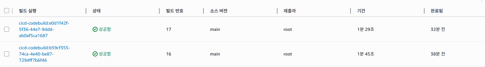
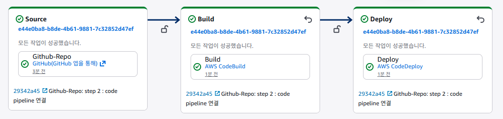
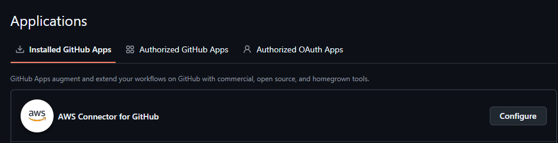
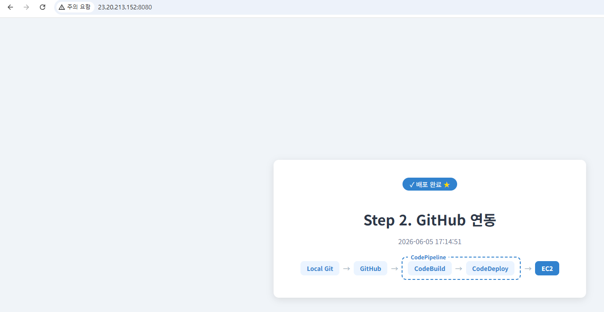

# Step2. GitHub + AWS Code 시리즈로 CI/CD 구성

> [CodePipeline]
>
> `GitHub` ➔ `AWS CodeBuild` ➔ `AWS CodeDeploy` ➔ `AWS EC2`

---

## 1. 역할 생성

> Step 재사용. 별도 생성 불필요.

---

## 2. 대상 EC2 생성

> Step 1과 동일하게 재사용. 별도 생성 불필요.

---

## 3. Github Repo 생성 및 연동



---

## 4. 설정 파일 구성

> Step 1과 동일하게 재사용. 별도 생성 불필요.

---

## 5. CodeBuild 프로젝트 (Source : Code Commit → Github으로 변경)



## 6. CodePipeline 생성



로컬 Git에서 커밋 후 GitHub으로 푸시하면 GitHub Webhook이 CodePipeline을 트리거하고, 이후 CodeBuild → CodeDeploy 순으로 자동 실행됨.

CodePipeline Source에 GitHub 연동 시 아래와 같이 AWS Connector 앱 설치 화면이 뜨며, 설치 완료 후 연결됨.



---

## 7. 배포 결과



---

## 트러블슈팅

### GitHub에 AWS Connector 앱 설치 필요

CodeConnections로 GitHub 연결 시 GitHub → Settings → Applications → Installed GitHub Apps 에서 **AWS Connector for GitHub** 앱이 설치되어 있어야 함. 없으면 AWS 콘솔에서 연결 생성 시 GitHub 앱 설치까지 같이 진행해야 함.

### CodePipeline GitHub 연결 권한 오류

`Unable to use Connection` 오류 발생 시 CodePipeline 서비스 역할에 아래 인라인 정책 추가.

```json
{
  "Version": "2012-10-17",
  "Statement": [
    {
      "Effect": "Allow",
      "Action": "codeconnections:UseConnection",
      "Resource": "<연결 ARN>"
    }
  ]
}
```
